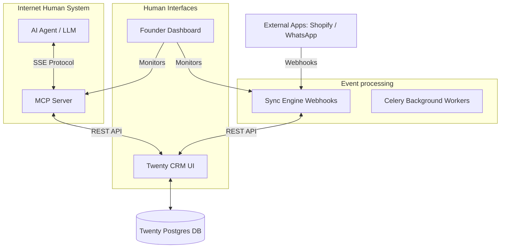

# Workspace CRM: Executive Architecture & Capability Report

> [!NOTE] 
> **Prepared For:** Management & Stakeholders
> **Project:** Workspace CRM (White Gloves Collaboration Layer)
> **Core Technology:** Twenty CRM, Model Context Protocol (MCP), FastAPI, Next.js

---

## 1. Executive Summary

Workspace is a **White Gloves collaboration layer** built entirely on top of [Twenty CRM](https://twenty.com). Instead of building a CRM from scratch or forking an existing one, Workspace leverages a completely unmodified, stock version of Twenty CRM as its foundational data layer. 

On top of this robust foundation, Workspace introduces a paradigm shift: **The Internet Human**. Workspace treats AI agents not as external chat tools, but as native, asynchronous workspace members who can receive tasks, manage escalations, and sync data autonomously. 

## 2. Core Architecture Philosophy

Workspace follows a strict architectural boundary to ensure long-term stability and upgradeability:

1. **Unmodified Core:** Twenty CRM remains completely untouched. We use official Twenty APIs, Webhooks, and Custom Objects to interact with it.
2. **Event-Driven Nervous System:** A Python-based Sync Engine listens for events (from Shopify, WhatsApp, or Twenty itself) and processes them via background task queues (Celery).
3. **The AI Brain Interface:** A dedicated **MCP (Model Context Protocol) Server** exposes Twenty CRM's capabilities to AI agents in a secure, standardized way.

---

## 3. Key Features

### 🏢 1. Robust Data Foundation (via Twenty CRM)
- **Standard Objects:** Out-of-the-box support for People, Companies, Tasks, and Notes.
- **Custom Objects:** Seamlessly extended to support e-commerce `Orders`, marketing `Campaigns`, and customer service `Escalations`.
- **Relational Integrity:** Customers are linked to Orders, Orders are linked to Escalations, creating a unified 360-degree view of the customer.

### ⚡ 2. Real-Time Sync Engine
- **Multi-Source Ingestion:** Dedicated webhook endpoints for Twenty CRM events, Shopify orders, and custom "White Gloves" system events.
- **Asynchronous Processing:** Powered by Redis and Celery, ensuring that heavy API operations don't block the system and automatically retry on failure.

### 🧠 3. The Internet Human Integration (MCP)
- **Standardized AI Control:** Uses the industry-standard Model Context Protocol to expose CRM functions to AI securely.
- **Granular Permissions:** The AI can only execute predefined "Tools" (e.g., `create_task`, `resolve_escalation`, `search_customer`).

### 📊 4. The Command Center
- **Founder Dashboard:** A sleek, dark-mode Next.js dashboard providing high-level analytics (Revenue, Active Escalations, AI Task Completion Rate).

---

## 4. How the "Internet Human" System Works

The "Internet Human" (codenamed **Aanya**) is a breakthrough in AI integration. Rather than operating as a chatbot, Aanya operates as an autonomous employee.

### The Flow of Autonomy:
1. **Trigger:** A high-value customer's Shopify order is flagged with high RTO (Return to Origin) risk by the Sync Engine.
2. **Assignment:** The Sync Engine creates an `Escalation` object in Twenty CRM and automatically assigns a `Task` to Aanya.
3. **Execution:** Aanya (the LLM) connects to the **MCP Server**. She sees she has a task.
4. **Action:** Aanya uses the `search_customer` tool to fetch the customer's details, drafts a personalized WhatsApp message, and uses the `complete_task` tool to log her actions.

> [!TIP]
> Because Aanya uses the MCP Server, she interacts with the exact same Twenty REST APIs that human developers use. She leaves audit trails, notes, and status updates exactly as a human employee would.

---

## 5. Human Interface & Usability

Real humans interact with the Workspace ecosystem through two primary interfaces, ensuring distinct roles are catered to effectively:

### A. The Operations Team (Using Twenty CRM)
Sales reps, customer success managers, and support staff spend their day inside the **Twenty CRM UI**. 
- They see Aanya as just another user in the workspace.
- They can assign tasks to Aanya by simply selecting her from a dropdown menu.
- They can read notes left by Aanya on customer profiles.
- **Learning Curve: Zero.** They use standard CRM workflows.

### B. Leadership & Management (Using the Founder Dashboard)
Founders and managers use the custom **Next.js Dashboard**.
- **Metrics at a Glance:** Live charts tracking revenue, system health, and escalation resolution times.
- **AI Oversight:** A dedicated widget showing the live "pulse" of the Internet Human (e.g., "Aanya is currently processing 3 escalations").
- **Intervention:** The ability to step in and take over an escalation if the AI flags it as requiring human empathy or managerial approval.

---

## 6. Future Extensibility

Because Workspace respects the architectural boundaries of Twenty CRM, future scaling is highly predictable:
- **Adding New AI Capabilities:** Simply write a new Python function in the `mcp_server/main.py` file to expose a new "Tool" to the Internet Human.
- **Adding New Integrations:** Add a new route to the `sync_engine/main.py` FastAPI app to ingest data from Stripe, Zendesk, or internal databases.
- **Upgrading Twenty:** Because Twenty is never forked, you can update the Twenty CRM Docker image to the latest release at any time to receive new core CRM features for free.
